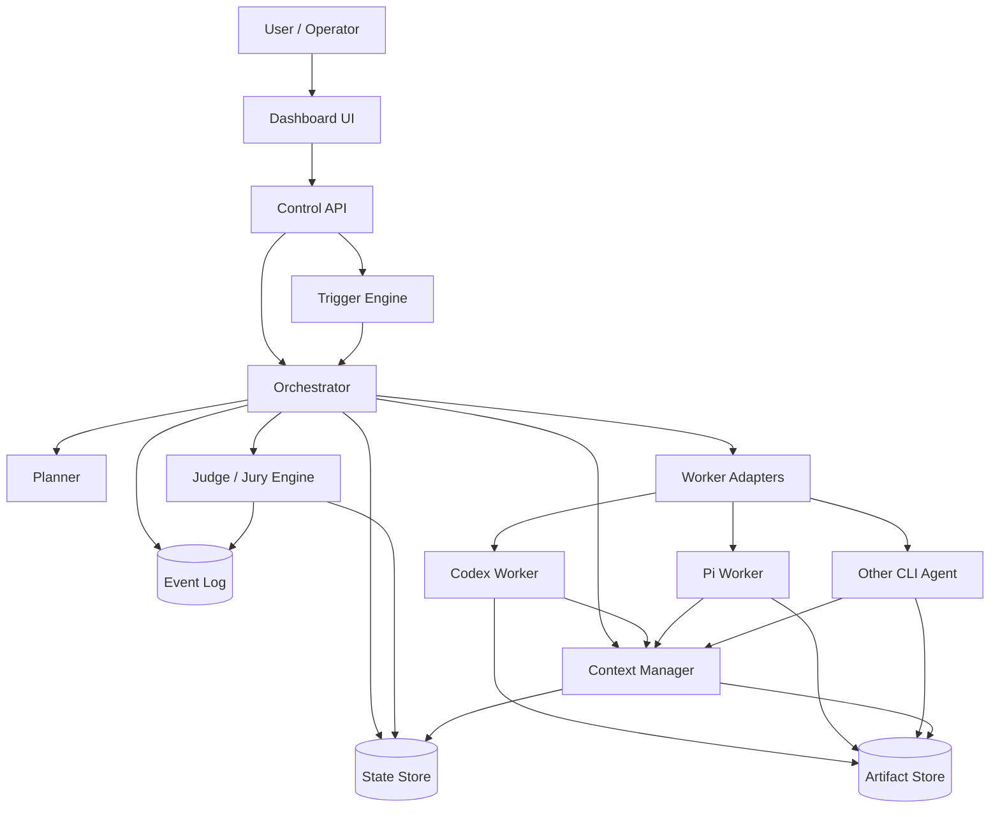
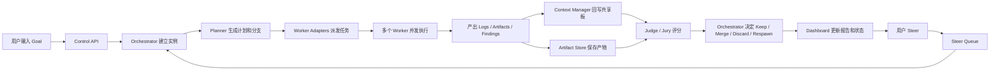
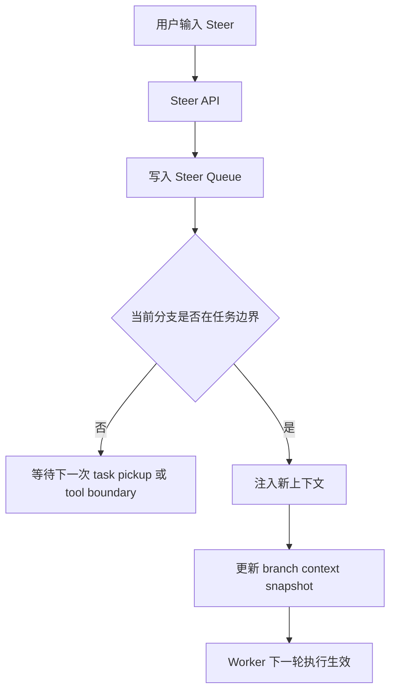
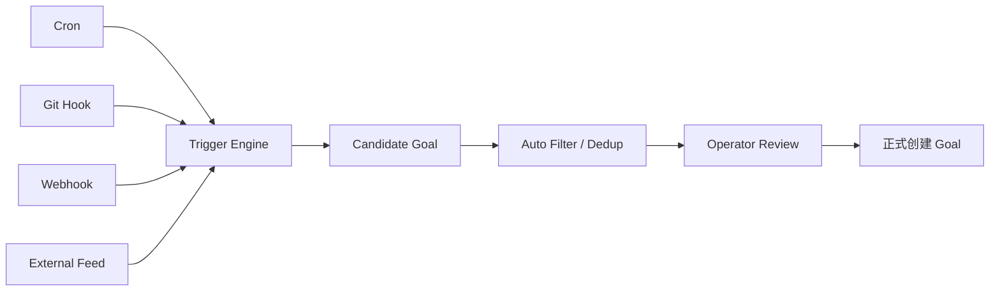
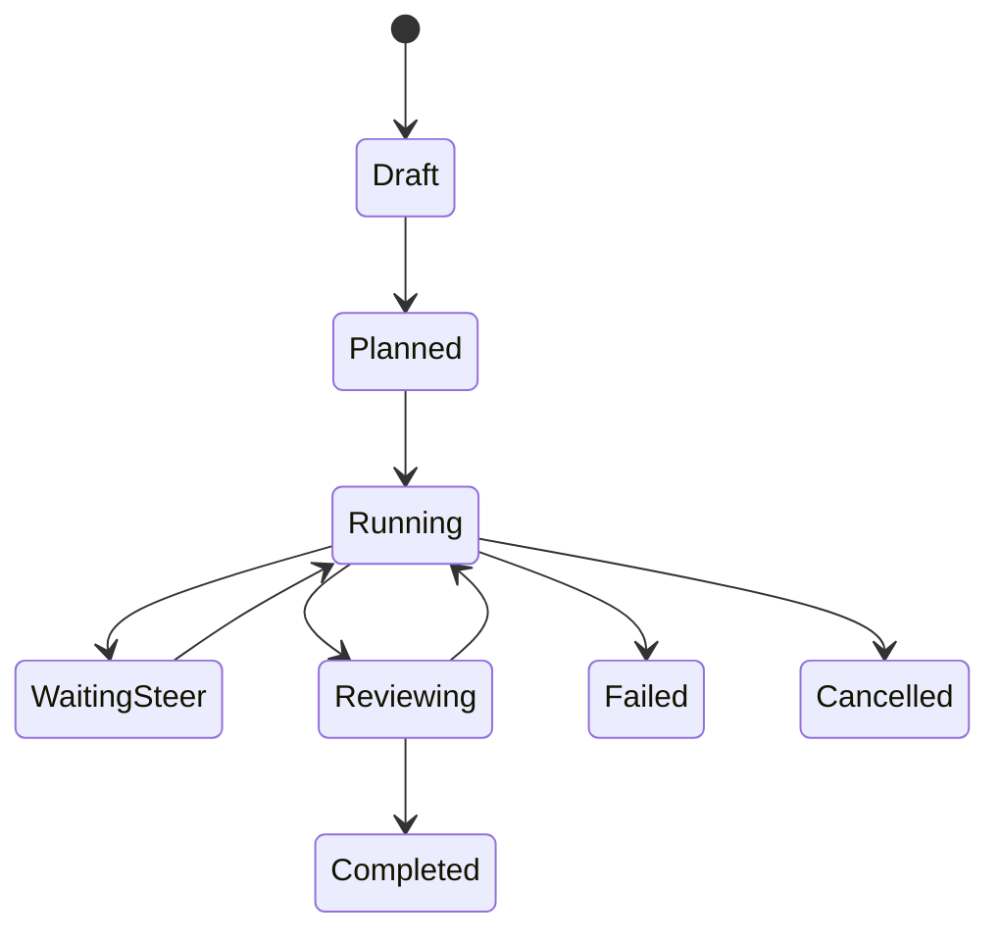
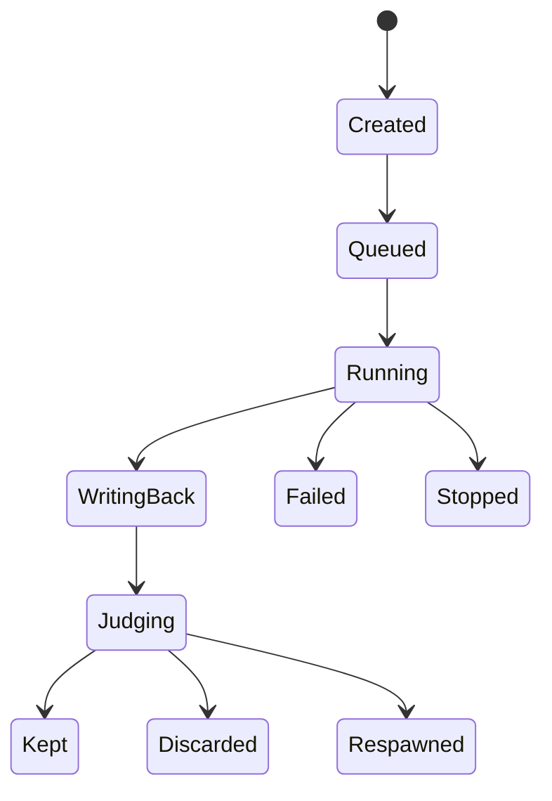

# AutoResearch Swarm Dashboard PRD

## 文档信息

- 文档版本：`v0.1`
- 创建日期：`2026-03-20`
- 适用阶段：`MVP -> V1`
- 文档目标：将群聊中提出的 `autoresearch swarm os/dashboard` 思路收敛为可执行的产品和技术方案
- 主要输入来源：
  - 群聊文件：[群聊_搞一点点🤏睡后收入.txt](E:\0-1_WeChat_Memo\分析\3-20\群聊_搞一点点🤏睡后收入.txt)
  - 外部参考：
    - `karpathy/autoresearch`
    - `openclaw/openclaw`
    - `badlogic/pi-mono` 中的 `coding-agent`

## 1. 背景

### 1.1 问题背景

当前已有的 code agent、research agent、assistant agent 已经具备单点执行能力，但缺少一个面向“组织化多 agent 任务协作”的上层系统。群聊里今天对齐出的核心判断是：

1. 不需要从零重新造一个 worker agent。
2. 需要一个在现有 agent 之上的调度、观测、介入、上下文管理和评估系统。
3. 这个系统的第一阶段不应被命名为 `OS`，而应更克制地定义为 `dashboard`。
4. 它的内核逻辑可以借鉴 `autoresearch`，但不能停留在单线程、强目标函数、纯闭环探索上。
5. 它必须支持多方向探索、上下文回写、人工 steer、阶段性汇报和可管理的多实例运行。

### 1.2 群聊中已经形成的产品共识

基于 `2026-03-20` 讨论，可提炼出以下共识：

- 形态上是一个 `goal oriented` 的可视化控制面。
- 用户能看到任务进展、阶段性结论和最新报告版本。
- 用户可以介入，但不应粗暴打断最小执行单元。
- 系统需要支持 `cron`、`hook`、自动发现新 goal。
- 多个 agent 可以并行探索不同方向，而不是只做单线程递归。
- 各 agent 之间通过“上下文回写”互相影响，载体可以先简化为文件系统。
- 核心价值不在 worker 本身，而在“外层 loop + 共享上下文 + 评测择优 + dashboard”。

## 2. 产品定义

### 2.1 产品名称

`AutoResearch Swarm Dashboard`

### 2.2 一句话定义

一个运行在现有 agent 之上的多 agent 任务编排与观测系统，用于围绕一个目标发起多方向探索、持续回写上下文、接受人工 steer，并通过评估与择优推进任务收敛。

### 2.3 产品定位

这是一个 `agent orchestration control plane`，不是新的底层模型，不是新的 coding agent，也不是单纯的 chat UI。

### 2.4 目标用户

1. 高频使用 code agent 的个人开发者
2. AI 工程研究团队
3. 需要“多 agent 协同 + 长周期任务推进”的小团队
4. 想把零散自动化、skills、CLI、MCP 组织成稳定工作流的内部平台团队

### 2.5 核心价值

1. 把“单 agent 对话”升级为“多 agent 协作任务系统”
2. 把“临时脚本驱动”升级为“有状态、可复盘、可观测”的执行体系
3. 把“用户一次性下命令”升级为“目标驱动、可持续 steer 的任务推进”
4. 把“agent 输出一堆日志”升级为“报告、结论、证据、评分、分支状态的统一视图”

## 3. 产品目标与非目标

### 3.1 产品目标

#### G1. 支持多方向并发探索

围绕一个 goal 同时生成多个子方向，由不同 worker 并行执行。

#### G2. 支持共享上下文与回写

每个 worker 的中间发现、结论、证据和产物要能被系统记录，并可被其他 worker 或 orchestrator 读取。

#### G3. 支持人工 steer

用户可以在任务进行中注入新信息、偏好、约束、反馈，但默认不强行中断正在执行的最小原子任务。

#### G4. 支持评测与择优

系统对分支结果进行自动或半自动评估，决定保留、合并、废弃或继续分叉。

#### G5. 支持 dashboard 观测

用户要能在一个界面中看到：

- goal
- 当前分支树
- 各 worker 状态
- 最新共享结论
- 报告演进
- token / 时间 /预算消耗

#### G6. 支持多实例与组织化使用

不同用户、不同项目、不同团队可以各自管理自己的任务实例，同时复用一部分共享能力。

### 3.2 非目标

#### NG1. 不自研底层模型

模型、推理服务、provider 不属于本期核心。

#### NG2. 不优先做 worker 内核

第一阶段优先复用 `Codex`、`Pi`、`Claude Code`、内部 agent 或其他 CLI agent。

#### NG3. 不做完全自治闭环

系统不是追求无人参与的黑盒自治，而是追求“工程闭环 + 可观测 + 可调整”。

#### NG4. 不先做复杂企业组织系统

权限、审批、跨部门协作、资产中心等企业级能力不是 MVP 的第一优先级。

## 4. 典型使用场景

### 4.1 场景 A：技术研究

用户输入一个 research goal，例如：

- 比较三种 agent 架构的长期稳定性
- 调研某技术方向的竞品方案
- 评估某代码库是否适合接入 agent workflow

系统会：

1. 生成多个探索方向
2. 派发给多个 worker
3. 聚合结果
4. 输出持续更新的研究报告
5. 等待用户 steer 后继续下一轮

### 4.2 场景 B：工程方案推进

用户输入一个工程目标，例如：

- 为某项目设计 agent-first CLI 工作流
- 将若干内部工具封装成适合 agent 使用的 CLI
- 评估不同方案的实现成本和稳定性

系统将围绕可评估目标进行并发方案探索和 review。

### 4.3 场景 C：Issue 发现与自动立项

通过 `cron`、`hook`、仓库事件、群聊摘要、文档更新等来源，系统自动发现潜在 goal，生成候选 issue，等待用户确认后进入 swarm 执行。

### 4.4 场景 D：长周期任务管理

一个任务持续数小时到数天，用户不需要始终在线，但可以随时回来查看：

- 当前最优方向
- 哪些方向被淘汰
- 最新结论
- 下一步建议

## 5. 用户角色与职责

### 5.1 角色总览

| 角色 | 类型 | 核心职责 |
|------|------|----------|
| Sponsor / Owner | 人 | 定义业务目标、预算、优先级、验收标准 |
| Operator | 人 | 创建任务、观察面板、注入 steer、管理实例 |
| Reviewer / Jury | 人或 Agent | 评估候选结果、给出评分和偏好 |
| Orchestrator | 系统 Agent | 拆解目标、调度 worker、决定分叉/收敛 |
| Planner | 系统 Agent | 把 goal 转成具体执行计划和分支策略 |
| Worker Agent | 外部 Agent | 执行具体子任务，如编码、调研、总结、验证 |
| Judge | 系统 Agent | 基于 eval 规则对产物进行评分 |
| Context Manager | 系统模块 | 管理共享上下文、事件流、知识板 |
| Trigger Engine | 系统模块 | 根据 cron、hook、外部事件创建候选 goal |

### 5.2 各角色任务说明

#### Sponsor / Owner

- 设定目标
- 定义成功标准
- 给出预算边界
- 决定是否继续投资某方向

#### Operator

- 启动任务
- 查看 dashboard
- 插入 steer
- 处理异常
- 选定最终输出

#### Reviewer / Jury

- 对多个方向的结果打分
- 提供“为什么更优”的解释
- 减少 orchestrator 盲目选择的风险

#### Orchestrator

- 接收 goal
- 请求 planner 制定计划
- 创建分支
- 选择 worker
- 监控执行状态
- 聚合结果
- 调用 judge
- 决定 keep / discard / merge / respawn

#### Planner

- 识别任务类型
- 判断是否可分治
- 定义分支策略和依赖关系
- 输出执行 DAG

#### Worker Agent

- 按分配到的任务执行
- 记录过程日志
- 产出 artifact
- 向共享板回写发现和结论

#### Judge

- 将产物与验收标准对比
- 产生分数、解释、建议动作

## 6. 核心产品原则

### 6.1 管理优先于自治

不追求一个完全自主的黑盒 agent 体系，而是优先构建一个可管理、可观测、可复盘、可插手的系统。

### 6.2 工程闭环优先于模型闭环

真正需要闭环的是任务工程流程，而不是让模型强行自己闭环到底。

### 6.3 Steer 不等于 Stop

系统默认允许插入新上下文，但尽量在任务边界、tool use 前、下次任务领取前生效，而非直接杀死当前执行。

### 6.4 文件系统优先于复杂基础设施

第一阶段可以用文件、Git、事件日志实现共享上下文，不急着上复杂数据库和知识图谱。

### 6.5 可评估才能规模化

只有任务的验收标准和评估逻辑足够清晰，系统才可能安全地放大并发和 token 消耗。

## 7. 需求范围

### 7.1 MVP 必须具备

1. 创建 goal
2. 生成计划与分支
3. 派发到外部 worker
4. 收集日志与 artifacts
5. 共享上下文板
6. 人工 steer
7. judge 评分
8. dashboard 展示
9. 任务历史与复盘

### 7.2 V1 应具备

1. cron / hook 自动触发
2. 多实例与团队空间
3. 更丰富的 eval 模型
4. branch merge 策略
5. 预算管控
6. 失败恢复和重试
7. worker 适配器体系

### 7.3 后续可选

1. 权限体系
2. 知识图谱
3. 长期记忆
4. 跨任务复用共享知识
5. 自动 issue 生成和 backlog 管理
6. 企业系统集成

## 8. 用户故事

### 8.1 Owner 视角

- 作为 Owner，我希望输入一个高层目标和验收标准，系统能自动拆解出若干可执行方向。
- 作为 Owner，我希望看到当前最有希望的方向，而不是自己翻所有日志。
- 作为 Owner，我希望在中途改变目标约束时，系统能从下一轮开始调整执行策略。

### 8.2 Operator 视角

- 作为 Operator，我希望一眼看到每个 worker 正在做什么。
- 作为 Operator，我希望在预算快耗尽时让系统自动降并发或暂停低分支。
- 作为 Operator，我希望能插入“以后都优先走 B 方案”这样的 steer。

### 8.3 Reviewer 视角

- 作为 Reviewer，我希望系统给我整理好候选结果、证据和差异点，而不是只给原始日志。
- 作为 Reviewer，我希望能快速给出保留、放弃、继续研究的判断。

### 8.4 Worker 视角

- 作为 Worker，我希望接到的是足够具体、可操作、边界清晰的任务。
- 作为 Worker，我希望能读取必要上下文，而不是整个世界状态。

## 9. 功能需求

### 9.1 Goal 管理

#### 功能点

- 创建 goal
- 编辑 goal
- 设置优先级、预算、期限
- 配置验收标准
- 添加约束与偏好

#### 关键字段

- `goal_id`
- `title`
- `problem_statement`
- `success_criteria`
- `constraints`
- `budget`
- `deadline`
- `owner`

### 9.2 Planning 与 Branching

#### 功能点

- 识别任务类型
- 决定是否可分治
- 创建 branch
- 定义 branch 间依赖
- 定义并发度

#### 输出

- 执行计划
- 分支树
- 初始分工
- eval 策略

### 9.3 Worker Dispatch

#### 功能点

- 选择适配器
- 启动 worker
- 注入上下文
- 跟踪状态
- 收集输出

#### 支持的 worker 类型

- `codex`
- `pi`
- `claude-code`
- 内部 agent CLI
- 自定义 agent adapter

### 9.4 Shared Context Board

#### 功能点

- 存放共享事实
- 存放候选结论
- 存放规范与约束
- 存放待验证问题
- 提供 branch 回写接口

#### 初期载体

- 文件系统目录
- Markdown 板
- JSON 元数据
- NDJSON 事件流

### 9.5 Report Streaming

#### 功能点

- 汇总阶段性结论
- 展示每一轮更新
- 输出“目前最可信版本”
- 标记哪些结论仍待验证

### 9.6 Steer 与 Human-in-the-loop

#### 功能点

- 插入新背景
- 修改偏好
- 修改优先级
- 修改预算
- 终止某一分支
- 强制增加某一分支

#### 核心约束

- steer 默认在边界时刻生效
- stop 是显式动作，不能与 steer 混淆

### 9.7 Evaluation / Jury

#### 功能点

- 自动评分
- 多审稿人评分
- 差异解释
- 决策建议

#### 支持的输出

- `score`
- `confidence`
- `evidence`
- `recommended_action`

### 9.8 Trigger Engine

#### 功能点

- cron 触发
- hook 触发
- 外部事件转 goal
- 候选 issue 生成

### 9.9 Dashboard

#### 页面模块

1. Goal 总览
2. Branch 树
3. Worker 状态面板
4. Shared Board
5. Live Report
6. Steer 面板
7. Budget / Token 面板
8. Events 时间线

## 10. 非功能需求

### 10.1 稳定性

- 单个 worker 崩溃不应拖垮整个任务实例
- orchestrator 需支持重启恢复
- 事件流要可追溯

### 10.2 可扩展性

- worker 采用 adapter 模式
- judge 可替换
- trigger 可扩展

### 10.3 可观测性

- 记录任务级、分支级、worker 级状态
- 支持 token、时间、失败率监控

### 10.4 可复盘性

- 所有关键决策有事件记录
- 所有报告版本可回溯

### 10.5 成本控制

- 有预算上限
- 有并发上限
- 有自动降级策略

## 11. 信息架构

### 11.1 实例层级

```text
Workspace
└── Project
    └── Goal Instance
        ├── Plan
        ├── Branches
        ├── Shared Context
        ├── Reports
        ├── Events
        └── Budget / Metrics
```

### 11.2 页面结构

```text
Dashboard
├── Home
├── Goal Detail
│   ├── Summary
│   ├── Branch Tree
│   ├── Live Report
│   ├── Shared Board
│   ├── Events
│   ├── Budget
│   └── Steer
├── Triggers
├── Templates
└── History
```

## 12. 系统架构

### 12.1 高层架构图



### 12.2 核心架构原则

1. `Dashboard` 只是控制面，不承担复杂执行逻辑。
2. `Orchestrator` 是调度中心。
3. `Worker Adapter` 抽象底层 agent 差异。
4. `Context Manager` 管理共享上下文。
5. `Event Log` 是系统事实来源之一。
6. `Artifact Store` 保存原始输出和中间产物。

## 13. 数据流图

### 13.1 主数据流



### 13.2 Steer 数据流



### 13.3 自动触发数据流



## 14. 模块分解

### 14.1 Dashboard UI

#### 职责

- 展示系统状态
- 承接用户操作
- 提供 goal / branch / report / steer 视图

#### 子模块

- Goal 列表页
- Goal 详情页
- Branch 树视图
- Shared Board 面板
- Live Report 面板
- Events 时间线
- Budget 面板
- Steer 面板

### 14.2 Control API

#### 职责

- 提供统一的前后端接口
- 做基础权限校验
- 写入命令和查询

#### 典型接口

- `POST /goals`
- `GET /goals/:id`
- `POST /goals/:id/steers`
- `POST /goals/:id/branches/:branchId/stop`
- `GET /goals/:id/report`
- `GET /goals/:id/events`

### 14.3 Orchestrator

#### 职责

- 实例生命周期管理
- 分支调度
- worker 派发
- 状态推进
- 失败恢复

#### 内部子能力

- lifecycle manager
- branch scheduler
- retry manager
- merge coordinator
- budget controller

### 14.4 Planner

#### 职责

- 理解 goal
- 做任务分解
- 判断是否适合分治
- 定义 eval strategy

#### 输出对象

- `plan.md`
- `branch_specs.json`
- `eval_spec.json`

### 14.5 Worker Adapter Layer

#### 职责

- 将统一任务协议转换为具体 agent 所需的调用方式
- 处理 stdout / stderr / events / artifacts 回传

#### 适配器设计

每个 adapter 至少实现：

- `startTask`
- `pollStatus`
- `injectContext`
- `stopTask`
- `collectArtifacts`
- `normalizeOutput`

### 14.6 Context Manager

#### 职责

- 管理共享上下文
- 管理 branch 局部上下文
- 管理 steer 注入
- 管理知识板与待验证问题

#### 数据结构

- `shared_facts.md`
- `open_questions.md`
- `constraints.md`
- `branch_notes/<branch_id>.md`
- `context_snapshot.json`

### 14.7 Judge / Jury Engine

#### 职责

- 对比结果和目标
- 产生分数、解释和建议
- 支持单 judge 或多 jury

#### 输出

- `score`
- `dimension_scores`
- `confidence`
- `recommendation`
- `rationale`

### 14.8 Trigger Engine

#### 职责

- 从外部事件中发现潜在任务
- 自动归档成候选 goal

### 14.9 State Store

#### 职责

- 保存结构化状态

#### 典型实体

- Goal
- Plan
- Branch
- WorkerRun
- Steer
- EvalResult
- BudgetUsage

### 14.10 Event Log

#### 职责

- 保存系统关键事件
- 用于回放、审计、调试和复盘

#### 事件示例

- `goal.created`
- `plan.generated`
- `branch.spawned`
- `worker.started`
- `worker.finished`
- `artifact.saved`
- `steer.queued`
- `steer.applied`
- `judge.completed`
- `branch.discarded`
- `report.updated`

## 15. 核心对象模型

### 15.1 Goal

| 字段 | 类型 | 说明 |
|------|------|------|
| id | `string` | 目标实例 ID |
| title | `string` | 目标标题 |
| description | `string` | 目标描述 |
| success_criteria | `string[]` | 成功标准 |
| constraints | `string[]` | 约束 |
| owner_id | `string` | 所有者 |
| status | `enum` | 状态 |
| budget | `json` | token / time / cost |

### 15.2 Branch

| 字段 | 类型 | 说明 |
|------|------|------|
| id | `string` | 分支 ID |
| goal_id | `string` | 所属目标 |
| parent_branch_id | `string?` | 父分支 |
| hypothesis | `string` | 该分支假设 |
| assigned_worker | `string` | 绑定的 worker |
| status | `enum` | 执行状态 |
| score | `number?` | 当前得分 |
| context_snapshot_id | `string` | 上下文快照 |

### 15.3 WorkerRun

| 字段 | 类型 | 说明 |
|------|------|------|
| id | `string` | 运行实例 ID |
| branch_id | `string` | 所属分支 |
| adapter_type | `string` | 使用的 adapter |
| prompt_spec | `json` | 任务定义 |
| state | `enum` | 当前状态 |
| started_at | `datetime` | 开始时间 |
| ended_at | `datetime?` | 结束时间 |
| token_usage | `json` | token 消耗 |

### 15.4 Steer

| 字段 | 类型 | 说明 |
|------|------|------|
| id | `string` | steer ID |
| goal_id | `string` | 目标 ID |
| scope | `enum` | goal / branch / worker |
| content | `string` | 注入内容 |
| apply_mode | `enum` | immediate_boundary / next_pickup / manual |
| status | `enum` | queued / applied / expired |

## 16. 状态机设计

### 16.1 Goal 状态



### 16.2 Branch 状态



## 17. 上下文系统设计

### 17.1 为什么上下文系统是核心

群聊里明确指出：真正难的不是调起多个 agent，而是“组织的上下文系统怎么改”。这意味着本产品的核心不是 prompt engineering，而是上下文治理。

### 17.2 上下文分层

#### Layer 1. Global Workspace Context

全局规则、基础配置、共享术语、组织规范。

#### Layer 2. Project Context

项目背景、技术栈、历史决策、相关资产。

#### Layer 3. Goal Context

目标说明、成功标准、约束、最新 steer。

#### Layer 4. Branch Context

该分支的假设、已验证发现、本地笔记、局部证据。

#### Layer 5. Runtime Context

当前任务单、最近事件、待执行动作。

### 17.3 Context 写入原则

1. 共享事实与主观猜测分开写
2. 已验证与待验证分开写
3. 系统总结与原始 artifact 分开存
4. 不能无限堆上下文，必须做摘要与裁剪

## 18. Worker 协议设计

### 18.1 统一任务协议

每个 worker 接收的最小结构：

```json
{
  "goal_id": "goal_001",
  "branch_id": "branch_003",
  "task_type": "research",
  "objective": "比较三种可行方案",
  "success_criteria": [
    "给出清晰优劣分析",
    "至少附带两个证据来源"
  ],
  "constraints": [
    "不要修改主分支",
    "预算不超过 2M token"
  ],
  "context_snapshot_ref": "ctx_20260320_01",
  "writeback_targets": [
    "shared_facts",
    "branch_notes",
    "artifacts"
  ]
}
```

### 18.2 统一回写协议

```json
{
  "branch_id": "branch_003",
  "findings": [
    {
      "type": "fact",
      "content": "Pi 适合作为 RPC worker 集成",
      "evidence": ["url_1"]
    }
  ],
  "questions": [
    "是否需要强一致同步？"
  ],
  "artifacts": [
    {
      "type": "report",
      "path": "artifacts/branch_003/report.md"
    }
  ],
  "recommended_next_steps": [
    "为 Codex 和 Pi 各建一个 adapter"
  ]
}
```

## 19. 评估系统设计

### 19.1 为什么必须评估

群聊中已经明确：`autoresearch` 只适合目标函数确定的场景。如果没有评估系统，就无法把多 agent 并发扩大到可控规模。

### 19.2 评估维度

不同任务类型可配置不同维度，但基础维度建议包括：

| 维度 | 说明 |
|------|------|
| Relevance | 是否切中目标 |
| Evidence Quality | 证据质量 |
| Correctness | 正确性 |
| Novelty | 是否提供新信息 |
| Actionability | 是否可执行 |
| Cost Efficiency | 成本效率 |

### 19.3 评估方式

1. 规则评估
2. LLM Judge
3. 多 agent Jury
4. 人工终审

### 19.4 决策动作

- `keep`
- `merge`
- `discard`
- `rerun`
- `spawn_followup`
- `request_human_review`

## 20. 报告系统设计

### 20.1 报告目标

不是输出一份最终 PDF，而是维护一个“持续更新的当前最优报告版本”。

### 20.2 报告层次

- Executive Summary
- Current Best Answer
- Evidence Table
- Competing Branches
- Open Questions
- Recommended Next Steps

### 20.3 报告更新时机

- branch 完成一次执行后
- judge 完成评估后
- operator 注入重要 steer 后

## 21. 预算与成本控制

### 21.1 预算维度

- token 预算
- 时间预算
- 并发预算
- 成本预算

### 21.2 控制策略

- 达到预算阈值自动降并发
- 低分支优先淘汰
- 优先保留高价值分支
- 大任务自动拆为阶段预算

## 22. 安全与风险

### 22.1 产品风险

1. worker 结果质量不稳定
2. 上下文持续膨胀导致污染
3. 任务并发过高导致成本失控
4. 用户以为 steer 会立即生效，实际存在边界延迟
5. 没有清晰 eval 时会出现伪进展

### 22.2 技术风险

1. 多 adapter 行为不一致
2. orchestrator 状态恢复复杂
3. branch merge 冲突难以统一
4. 事件流与状态存储可能不一致

### 22.3 缓解手段

1. MVP 限制 worker 类型
2. 先使用文件系统和结构化事件简化实现
3. 所有关键动作事件化
4. steer 明确展示“待应用”状态
5. 强制 goal 配置 success criteria

## 23. MVP 方案

### 23.1 MVP 产品边界

MVP 只解决一个核心问题：

> 让用户围绕一个 goal 启动 2 到 5 个并行 agent 分支，在 dashboard 上观察、插入 steer、汇总报告，并对结果做择优。

### 23.2 MVP 组成

1. `Dashboard UI`
2. `Control API`
3. `Orchestrator`
4. `Codex Adapter`
5. `Pi Adapter`
6. `Context Manager`
7. `Judge Engine`
8. `File-based Store + Event Log`

### 23.3 MVP 暂不做

1. 企业权限系统
2. 自动 issue 池
3. 长期记忆图谱
4. 复杂 merge automation
5. 多租户隔离强化

## 24. 技术方案建议

### 24.1 建议的实现策略

#### 前端

- `Next.js` 或其他成熟 Web 框架
- `Mermaid` / 图形组件用于 branch tree 和流图

#### 后端

- `TypeScript` 或 `Python`
- 事件驱动 + 任务队列

#### 存储

- 结构化状态：`SQLite` 或 `Postgres`
- 事件流：`NDJSON` 或数据库事件表
- artifacts：本地文件系统 / 对象存储

#### worker 交互

- CLI 调用优先
- 对支持 `RPC / JSON mode` 的 agent 做更深集成

### 24.2 为什么先用文件系统

因为今天群里已经明确提到“其实也就是文件夹罢了”。这不是简陋，而是符合第一阶段需求：

- 易观察
- 易调试
- 易回放
- 易和现有 agent 兼容

## 25. 里程碑规划

### 25.1 Milestone 0：概念验证

- 单 goal
- 单 planner
- 2 个 worker
- 文件系统共享板
- 简易 dashboard

### 25.2 Milestone 1：MVP

- 多 branch
- steer queue
- judge 评分
- report streaming
- 基础预算面板

### 25.3 Milestone 2：V1

- trigger engine
- 多实例管理
- 更强的 branch tree
- 更强的恢复与重试

### 25.4 Milestone 3：组织化使用

- team workspace
- 模板化 goal
- 知识复用
- 自动候选 issue 发现

## 26. 成功指标

### 26.1 产品指标

- 创建到第一次可用结论的时间
- 每个 goal 的平均分支数
- steer 使用率
- 人工 review 后采纳率
- 报告被继续迭代的比例

### 26.2 工程指标

- worker 成功率
- 任务恢复成功率
- 平均 token 成本
- 低质量分支淘汰速度

### 26.3 用户价值指标

- 用户从“单进程用 agent”转为“多分支并发探索”的比例
- 用户复用模板创建第二个 goal 的比例

## 27. 开放问题

1. 不同 worker 的能力差异如何标准化？
2. branch 之间的上下文同步粒度应多大？
3. 什么时候应该自动 merge，什么时候只保留并列分支？
4. jury 多审稿人的分歧如何收敛？
5. trigger engine 自动创建的 goal 如何避免噪音过高？

## 28. 结论

这套系统的本质不是“再造一个更聪明的 agent”，而是把现有 agent 组织成一个可持续运行、可评估、可管理的 swarm。

它的最小正确方向不是 `OS`，而是 `dashboard + orchestrator + shared context + steer + eval`。

如果用一句工程语言总结：

> `AutoResearch Swarm Dashboard` 是一个将单线程 autoresearch 思想扩展为多分支、可观测、可插手、可择优的上层控制系统。

## 29. 外部参考

- `karpathy/autoresearch`
  - 核心启发：单线程自动实验、评估、保留/丢弃循环
- `openclaw/openclaw`
  - 核心启发：control plane、长期运行助手、trigger / cron / hook / UI
- `badlogic/pi-mono`
  - 核心启发：适合作为外部系统调用的 coding agent runtime

