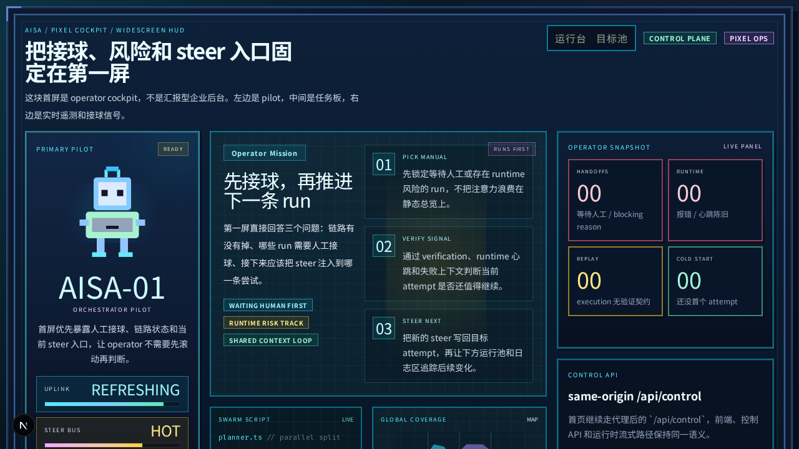
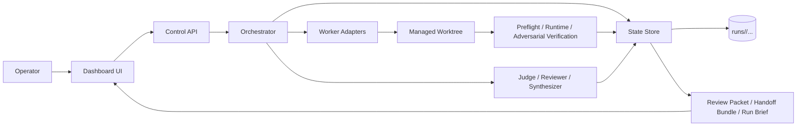

# AISA

`AISA` 是一套给长周期 AI 开发任务用的 control plane。

它不想把 AI 包装成“会自动完成一切”的黑盒，而是把每一次推进都收成可追踪、可验证、可接管、可续跑的 `run -> attempt -> review -> next step` 闭环。



## 先看这 4 句

- 把一条持续推进的 AI 任务收成一个 `run`，而不是零散聊天记录。
- 把 AI 的每一轮动作收成一个 `attempt`，并强制留下验证记录、交接说明（`handoff`）和 review packet。
- 在真正发车前先跑发车前检查（`preflight`）/ shadow dispatch，尽量把“运行后才暴露的问题”提前 fail-closed。
- 让人类打开 dashboard 时，第一眼就知道：现在卡在哪、是不是需要你处理、下一步该做什么。

## 用人话解释这个项目

你可以把 AISA 理解成一个 “AI 项目驾驶舱”。

它要解决的问题不是“怎么再做一个聊天 UI”，而是：

- 一条任务让 AI 连续做很多轮之后，人还能不能看懂当前状态。
- AI 说“我做完了”时，系统能不能拿到可回放的验证证据。
- 如果 AI 失败、卡住、环境坏掉，系统能不能明确告诉你是继续、重试，还是等人接球。
- 如果要让 AI 继续开发自己，系统能不能把现场和下一步建议稳定地交给下一轮。

核心对象只要记住 4 个就够了：

- `Run`: 一条持续推进的任务。
- `Attempt`: 这条任务的一轮具体尝试。
- `Review Packet`: 这轮尝试留下的结构化证据。
- `Handoff Bundle`: 下一轮 AI 或人类继续接手时要看的最小交接说明包。

## 当前它已经能做什么

- `control-api` 可以创建、启动、steer、读取 `run` 与 `attempt`。
- `dashboard` 已经在往 run-first / triage-first 的 operator board 方向收，而不是纯展示墙。
- `orchestrator` 会围绕 `CurrentDecision` 持续推进 `research -> execution -> evaluation -> next attempt`。
- execution 会跑在独立 managed worktree 里，不直接污染源工作区。
- 系统会留下可回放的验证约定、runtime verification、review packet 和 handoff bundle。
- reviewer pipeline 支持多 reviewer + synthesizer，不只是一条单点评价链。
- `bootstrap:self` / `supervise:self-bootstrap` 已经能让系统以自举方式继续推进自己。

## 架构图



## 5 分钟跑起来

### 1. 安装依赖

```bash
pnpm install
```

### 2. 启动本地控制面

```bash
pnpm dev
```

默认本地地址：

- Dashboard: `http://127.0.0.1:3000`
- Control API: `http://127.0.0.1:8787`

### 3. 只跑单侧服务

```bash
pnpm --filter @autoresearch/control-api dev
pnpm --filter @autoresearch/dashboard-ui dev
```

### 4. 启动本地自举链路

```bash
pnpm bootstrap:self
pnpm supervise:self-bootstrap -- --target-completed-attempts 40
```

## 常用验证入口

README 只放最常用入口。更细的脚本说明见 [Scripts Guide](scripts/README.md)。

| Command | What it proves |
| --- | --- |
| `pnpm typecheck` | 全仓基本类型检查 |
| `pnpm verify:run-loop` | run / attempt 主循环、preflight、dispatch、治理链路 |
| `pnpm verify:runtime` | runtime 侧主回归入口 |
| `pnpm verify:run-api` | `GET /runs` / `GET /runs/:id` 的 control surface 回归 |
| `pnpm verify:self-bootstrap` | 自举 run、监督与恢复链路 |
| `pnpm verify:working-context` | working context 与 snapshot 现场保持 |

常见 focused 入口：

```bash
pnpm verify:worker-adapter
pnpm verify:drive-run
pnpm verify:dashboard-control-surface
pnpm verify:judge-evals
pnpm verify:policy-runtime
```

## 仓库分工

| Path | Responsibility |
| --- | --- |
| `apps/control-api` | 对外暴露 run / attempt / control surface |
| `apps/dashboard-ui` | operator dashboard 与 triage / detail surface |
| `packages/orchestrator` | 主循环、dispatch、preflight、runtime gate、handoff |
| `packages/domain` | 领域模型、schema、failure class、contract 类型 |
| `packages/state-store` | run / attempt / artifact 落盘与读取 |
| `packages/judge` | reviewer / synthesizer / evaluation 相关能力 |
| `packages/worker-adapters` | 执行适配层，当前以 Codex CLI 为主 |
| `scripts` | verify、bootstrap、seed、辅助脚本 |
| `docs` | PRD、roadmap、决策记录与实现文档 |

## 配置概览

常用环境变量：

- `CONTROL_API_HOST`
- `CONTROL_API_PORT`
- `NEXT_PUBLIC_CONTROL_API_URL`
- `CODEX_CLI_COMMAND`
- `CODEX_MODEL`
- `CODEX_PROFILE`
- `CODEX_SANDBOX`
- `AISA_REVIEWERS_JSON`
- `AISA_REVIEW_SYNTHESIZER_JSON`
- `OPENAI_API_KEY`
- `OPENAI_BASE_URL`

如果你只想先把系统跑起来，通常先配置 `control-api`、dashboard 和 worker adapter 相关变量就够了。

## 去哪看更多文档

- [Docs Index](docs/README.md)
- [Getting Started](docs/getting-started.md)
- [Run Lifecycle](docs/run-lifecycle.md)
- [Architecture](docs/architecture.md)
- [Glossary](docs/glossary.md)
- [PRD](docs/aisa-harness-prd-v1.md)
- [Roadmap](docs/aisa-harness-roadmap-v1.md)
- [Single-Run Hardening Roadmap](docs/aisa-single-run-core-hardening-roadmap.md)
- [Common Dev Scenarios Roadmap](docs/aisa-common-dev-scenarios-roadmap.md)
- [Implementation Blueprint](docs/implementation-blueprint.md)
- [Architecture Decisions](docs/decisions/0001-mvp-runtime.md)
- [Scripts Guide](scripts/README.md)

如果你的目标不是让 AISA 开发自己，而是把它接到一个外部项目上，优先看 [Common Dev Scenarios Roadmap](docs/aisa-common-dev-scenarios-roadmap.md)。

## 为什么它和普通 agent dashboard 不一样

普通 dashboard 更像“AI 正在跑”的状态屏。

AISA 更关心的是：

- 这轮为什么继续，为什么暂停。
- 哪条 gate 失败了，失败证据在哪里。
- 当前是不是需要你处理。
- 下一轮 AI 继续接手时，最小真相包是不是已经齐了。

所以它的核心不是“看起来智能”，而是“让持续推进这件事可验证、可接管、可恢复”。

## 当前 README 的定位

这份 README 只负责回答 5 个问题：

- 它是什么。
- 它解决什么问题。
- 我怎么 5 分钟跑起来。
- 我该从哪几个命令验证它。
- 我接下来去哪里看更深的文档。

更细的实现细节、roadmap 和模块文档，请从 [docs/README.md](docs/README.md) 继续进入。
